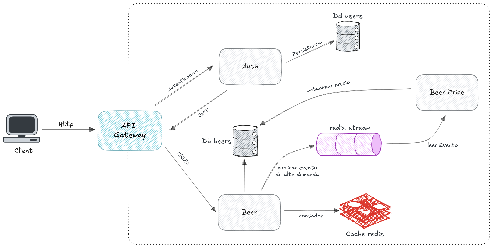
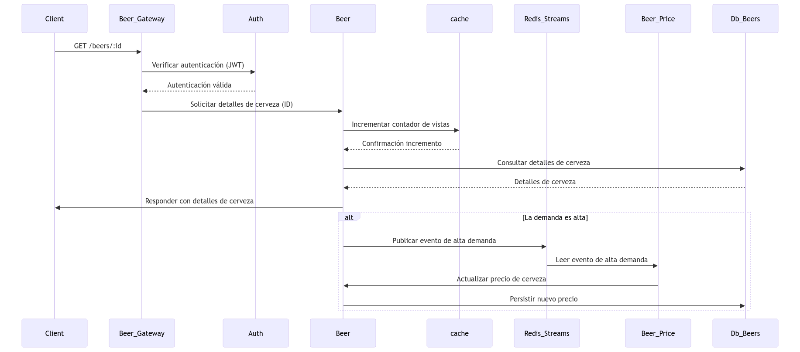
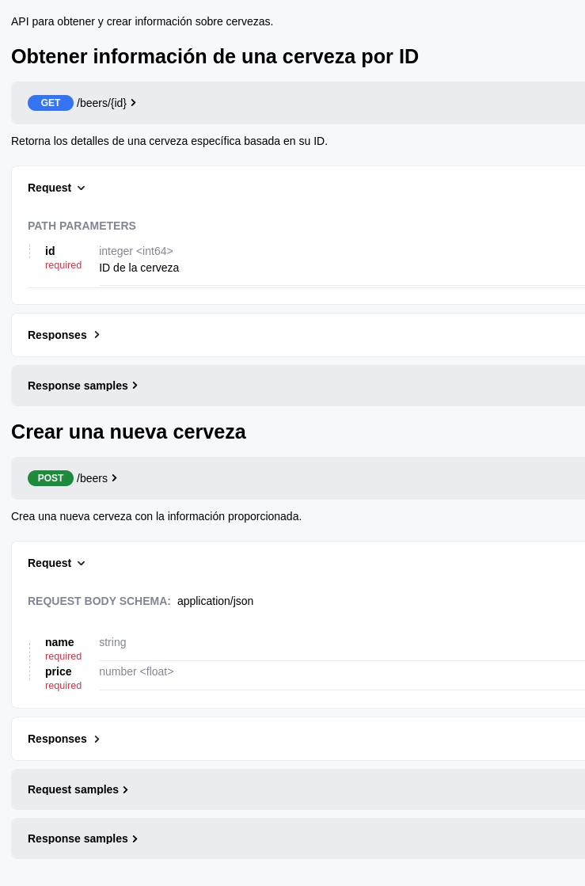

# Amaris - Prueba Técnica - Beers

> 💡 Consiste en desarrollar una API REST utilizando Golang con el framework Gin, aplicando una arquitectura hexagonal,
> adicional se requiere un proceso concurrente para la actualización dinámica de precios basada en la demanda.

## ⚙️ Diagrama de Solución



Esta arquitectura se basa en el diseño de sistemas distribuidos, donde los componentes centrales son independientes de
la infraestructura,
permitiendo una mayor flexibilidad y facilidad para realizar cambios en las partes externas sin afectar la lógica del
negocio.

## 🎲 Diagrama de Secuencia

### Get by ID


## 📚 Lista de operaciones

| Metodo | Path        | Descripcion                            | Destino |
|:-------|-------------|----------------------------------------|---------|
| POST   | /beers      | Crear una nueva cerveza.               | Beer    |
| PUT    | /beers/{id} | Actualizar información de una cerveza. | Beer    |
| DELETE | /beers/{id} | Eliminar una cerveza                   | Beer    |
| GET    | /beers      | Listar todas las cervezas.             | Beer    |
| GET    | /beers/{id} | Obtener detalles de una cerveza.       | Beer    |

## 📦 Estructura de los microservicios

La arquitectura usada en los servicios es hexagonal, también conocida como "Arquitectura de Puertos y Adaptadores", se organiza en torno a una estructura central (núcleo) rodeada por adaptadores que se comunican con el mundo exterior.
En este proyecto, se identifican las siguientes capas:

1. **model**: Contiene las definiciones de las estructuras de datos y entidades como `error.go`, `router.go`, etc
2. **domain**: Contiene la lógica de negocio agrupada en casos de uso e intefaces(para la inversión de de pendencias), en carpetas como `search` .
3. **infrastructure**: Maneja la interacción con servicios externos, bases de datos, llamada a otros servicios  y otros sistemas.
    - handler: Actúan como interfaces de entrada que reciben las solicitudes y responden a los clientes, se usa fiber.
4. **bootstrap**: Contiene scripts o archivos que configuran y preparan el entorno del proyecto.
5. .**amaris**: Contiene la documentación en **Open API** del endpoint principal del servicio

En el codigo de esta arquitectura se aplican buenas practicas como los principios SOLID, etc.

```
.
└── my-app
    ├── .amaris
    │   ├── openapi.yaml
    ├── bootstrap
    │   ├── bootstrap.go
    │   ├── env.go
    │   ├── gin.go
    │   ├── logger.go
    ├── domain
    │   ├── beer
    │   │   ├── beer
    │   │   ├── usecase
    ├── infrastructure
    │   ├── handler
    │   │   ├── beer
    │   │   │   ├── handler.go
    │   │   │   ├── router.go
    │   │   ├── response
    │   │   │   ├── message.go
    │   │   │   └── response.go
    │   │   └── router.go
    │   └── redis
    ├── model
    │   ├── error.go
    │   ├── logger.go
    │   ├── model.go
    │   ├── model_test.go
    │   └── router.go
    ├── Dockerfile
    ├── docker-compose.yaml   
    ├── go.mod
    ├── .env.example    
    └── main.go  
```
---

## 💻 Installation

1. **Instalación de herramientas Básicas**
- [Git](https://git-scm.com/book/en/v2/Getting-Started-Installing-Git)
- [Docker](https://docs.docker.com/get-docker/)
- [Docker Compose](https://docs.docker.com/compose/install/)

2. **Clonar los repositorios de los servicios**
   ```bash
   git clone https://github.com/MikelSot/amaris-beer-gateway
   git clone https://github.com/MikelSot/amaris-beer-price
   git clone https://github.com/MikelSot/amaris-beer
   ```

3. **Configurar de variables de entorno**

   En cada carpeta de los servicios se encuentra un archivo `.env.example` que contiene las variables de entorno necesarias para el correcto funcionamiento de los servicios,
   se debe copiar este archivo y renombrarlo a `.env` y configurar las variables de entorno necesarias.

## 🧙 Endpoints

La documentacion de los endpoints se encuentran en el archivo `.amaris`, en el archivo `openapi.yaml`
esta documentacion se encuentra escrita en formato **OpenAPI**, para lo cual se requiere que tenga instalado en su
editor una extension que le permita visualizar este tipo de archivos, en vscode puede instalar la extension `Swagger Viewer`.

En este archivo se encuentran los endpoints de la aplicacion, los metodos que aceptan, los parametros que reciben y los codigos de respuesta.

Acontinuacion se muestra un ejemplo de como se debe visualizar la documentacion de los endpoints.


